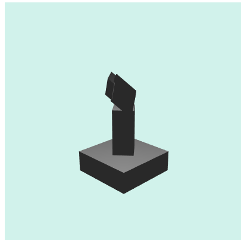
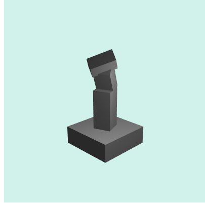

多个物体在场景中，尤其是包含父子节点关系，这种情况下会产生什么错误呢？
可能会：

从图中可以发现 Handle 以及 Arm1 对象的光影效果是错误的。
原因是 Handle a_Position 加入 modelMatrix 进行计算时还包含了 Arm1 arm 等之前对象的变换，这导致了光线渲染和实际变换产生了很大的误差。

因此在引擎中，对象通常存储两个矩阵，一个是世界坐标下的矩阵，一个是本地坐标下的矩阵。
光照的计算，应该涉及的是 **世界坐标** 下的矩阵，这样计算的内容才是对的，单纯的。

但是具体计算出的错误的值，我是不知道是多少哦。因此这个部分还只算是猜测。

正确的效果：

有效果的光影，