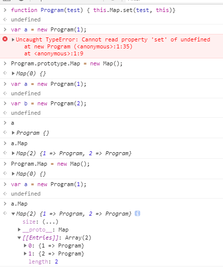

### 主进程与渲染进程

main 是主进程用于后台与 nodejs 进行交互

渲染进程主要是负责界面的信息交互。

一旦有什么 IO 流的内容需要传输，还是需要通过 main.js 与 renderer.js 之间的信息通讯机制才可以。

-----

关于 fragmentShader:
设计中使用了最基础的高光计算方式。
建议后续可以添加 Blinne Phone 或者 HalfLambert 这种计算。


----------
关于界面设计，我们使用 https://www.bilibili.com/video/av35942981/?p=38 安装 bower with bulma and font-awesome

```
npm install bower -g

bower i bulma
bower i font-awesome

```

electron-reload 帮助运行时快速刷新界面以及代码。

-------------------

在些这个的时候为了后期的遍历，我建议是创建一个 node 类，对初始化数据进行管理，并且最后的数据能够进行整合。
以及我们希望应用到 program 切换，skybox 等渲染技巧。
当然目前我们还不需要这些东西，在完成第一个 lighting map 之前。

同时我们还需要一个资源关系系统，用于 load 数据从 nodejs 的后台。
写一个监听者模式，方便传递调用吧，不要忘记回调。

希望后期增加一个选取 node 系统，可以用于展示 node 数据信息。

渲染也要有自己的进程。
如何在一帧内创建两个 cube 就需要使用两个 draw 啊。

draw 现在作为单独的渲染进程需要一个 foreach 去遍历节点。全部渲染。
而节点本身可以设置自己的 shader。
node 节点只保存物体的 path 而不去真正的获取 texture， 通过 asset 对象获取。

这就要求 asset 管理 main process 与 renderer process。

### 为了便于测试，我们优先将 lighting map 场景实现出来。

-----------
2019.9.6 
现在希望 js Program 持有一个静态的 map 存储新生的 program 对象。
但是不会写，因为 prototype 的关系， 新建一个实例，要从 prototype 中去寻找数据对象。
同时还要保证它能拿到最下层的 Map 表。

关于原型链，我们自己的理解和设计，假装 js 已知是一个完整的原型链模式。那么 function Object 两个对象的区别就在于 Object 不存在 prototype 但是实例的 Object 有一个 __proto__ 指向原型链的指针。
这个 proto 帮助 Object 在 function 创建的原型链上查找内容。

function 本身不表示原型链。


上图可见，Prototype 定义的 Map 对象在 a b 对象上也生效了，但是 Program.Map 本身没有对数据对象进行传入，而且 __a, b 也并不获取 Program.Map 而是获取原型链上的 Program.prototype.Map__。

顺便一提，对于 Object 或者非原始数据类型，js 一般都是引用指向。类似于 指针指向对象地址的浅拷贝，而不是深拷贝。

----------------
Node 需要自己记录 rotation position tetxture 至少三个属性

### 2019.9.9 进度
当前需要完成一个资源加载系统的管理，至少需要提供对应的管理 API, 当然，可以资源要求是同步资源。

AssetCtrl.LoadImage Target
AssetCtrl.LoadNode Target
AsserCtrl.LoadText Target
AssetCtrl.LoadGLSL Target -> program

在全部完成之前我们想要做的内容是什么？
我们首先得想好，有个明确的程序结构，之后才能安排出来一周的工作内容进度。

首先是一个基本的渲染框架，和 RenderWork 有些类似，但是我们希望有的功能包括但不限于：

1. 资源管理系统，界面上希望可以呈现出资源的内容在界面上。
    - 有什么用？可以用于切换资源吧。但是需要 Node 以及 Inspector 的配合，这个内容比较复杂。切换 shader，texture 之类的。

2. 渲染绘制系统，主界面展示一个 Canvas

3. 右侧边栏有一个 Node 属性展示面板，这就要求 Node 有自己的 select 方法。
- 渲染界面有一个 Gizmos 可以用于拖动物体，那么应该还要包含旋转。
- 因为需要的效果是固定的，那么就采用 Component 的形式，将需要的功能封装成 Compoent 需要的 Node 从右侧边栏中自己添加。
- color 可以替换，program 相关的参数可调整。
- rawTexture 不需要特别单独做一整个系统，但是要求有数据监听，在文件替换的时候能够即时的更新场景物体。

4. 所有的界面之间通过 Listener 进行交流
5. 左侧是一个界面展示菜单栏，用于更换渲染场景
    - 因为是我自己用，所以单纯的展示效果就好。不需要节点数。

6. 不需要上方的菜单栏

7. 不需要保存， undo， redo

今天优先处理 lightingMap 渲染，相关的资源暂时使用临时方案代替。

Image 内容需要异步通过 Image 加载。那么需要 renderer 进程和 main 进程进行配合。同时配合一下生产一个 loading 界面，要求优先把所以依赖的 image 图片加载到资源管理内。

这样有一个 loading 进程在场景呈现之前， Ready 是不会准备好的。

main process 的设计应该就是 IO 流，stream 可能会快一点，但是前期我们先不做对应的调整。

重点是设计 renderer process 的框架。
然后是文件管理，如何分离的问题。
分为两个大模块和一个小模块。
Project:
    - mainProcess
        - loadCtrl
        - serialized ? 暂时没必要？
    - rendererProcess
        - assetCtrl
        - MVP
        - ECS
        - renderer
    - windowUtil
        - drag
        - MVC
        - ListenerCtrl （window 间通讯）

mainProcess 与 rendererProcess 相互通信通过 ipc，设计一个总体的管控在 main， 若进程终端，就会断在 main 的 load 流程之间。
慢慢写，不着急。先把基础的 IO  通信跑通了再说。

#### 2019.9.9 18：00
处理事项优先级：
- 规范文件命名
- 完成 shader 和 image 加载流
- assetCtrl 管控 project 进程。

__dirname 文件的执行路径
__filename 文件执行路径 + 文件名称
process.cwd() 项目路径


globby 只能走相对路径便利。。。fo 了


#### 2019.9.11 10：10

我认为数据的处理都应该尽量的放在 main process 上，因为可以用 fs 之类的数据流。

数据的 处理流程一般都有一个固定的流程，首先是所有数据都会存在的一些类似于标识之类的东西，之后根据数据类型将数据传入其对应的管线进行后续处理。


textureObj 采用了异步中的自调用。

__mainProcess 的三种数据形式可以调整成为 继承 的形式。__

#### 2019.9.16

中间休息了三天（看小说去了，诡秘之主写的是真的不错），今天重新开始
今天开始把几个需要的类型给创建了，因为不清楚实际运用的时候可能会出现的应用，因此我们只写一些比较简单的引用。暂时不用考虑很多，以后用到了再补充。
今天需要：

vec2, vec3

node：
    - sprite
        - path
        - image
        - color -> glsl ?
    - Transform
        - position
        - anchor
        - size
        - rotation __打算做成四元数来着__

canvas 考虑做离屏或者 label 之后去考虑。

实际上我有点想去看看书，或者代码，比如那个什么光影追踪什么的。Rendering 那部分我都还没开始看。
先写吧。

屏幕渲染三个大的部分：

1. 数据传入
2. 离屏渲染
3. 渲染后处理

一旦开始考虑 scene ，就会涉及到 update 的模式。以及一些框架上的问题。
关于节点树之类的存储内容，涉及到 js 的内存优化，这个我们放到之后再看： [内存管理](https://blog.sessionstack.com/how-javascript-works-memory-management-how-to-handle-4-common-memory-leaks-3f28b94cfbec)


Scene 生命周期：
awake
start
update
lateUpdate

组件控制
component 控制新的组件加入一个 node
component 要有自己的 type

目前打算把 texture 作为 component。
要根据 glsl 的特性做 shader param 管理，而不是通常性的 scene 管理。

setTexture
setUniform
setAttribute

draw -> render => gl.drawElements / gl.draw
draw call count
固定数据可以放到 render 统一绑定。
但是目前没有，我们是分散的来的。

大部分的基础数据可以放到 Transform 这里来处理。
为了节省计算量，脏模式

__PS:__ presudo node 的作用更多的应该是用在了 light camera 之类的非渲染节点上。

camera 才能够有设置 lookAt 之类的参数，那么就应该做一些调整。
只有 camera 才需要 perspective 和 view

其他的 node 只需要 modelMatrix。
还可以考虑 多个 camera 的情况。

scene 需要持有 camera component
目前先只保留 scene array，不需要多个 scene

越写越庞大，部分的内容我们需要安放到后面去调整，优先把 lightingMap 中的 设置都搬出来。
今天暂时先不处理 camera， 优先将 lightingMap scene 中的对象转换成 node。
